# Klarmodus Blog-Illustrationen

Illustrationen für deutschsprachige Blogartikel als Handzeichnung oder Pixel-Art, dazu die Prompts und ein Codex-Skill, mit dem du eigene Motive erstellen kannst. Die Hauptfigur ist der K-Macher, unser Maskottchen aus dem Klarmodus-Logo.

Wir teilen das Projekt als Open Source, damit du die Bilder nutzen und die Vorlagen für deine eigenen Inhalte anpassen kannst.

## Nutzen und anpassen

- **Bilder verwenden:** Öffne ein Motiv aus der Galerie. Für die veröffentlichten Blogmotive stehen WebP-Dateien und PNG-Originale bereit.
- **Eigene Illustrationen erstellen:** Nutze den mitgelieferten Skill mit deinem Artikel oder probiere die [Beispielprompts](examples/prompts.md) aus.
- **Eine eigene Version entwickeln:** Passe Texte, Motive oder die Figur an deinen Anwendungsfall an. Die [K-Macher-Vorlagen](klarmodus-de-blog-illustrationen/assets/mascot/) und die [Figurenbeschreibung](klarmodus-de-blog-illustrationen/references/k-mascot.md) zeigen, wie unser Maskottchen eingebunden ist.

Das Projekt steht unter der [MIT-Lizenz](LICENSE). Bitte behalte bei der Weitergabe die Lizenz- und Copyright-Hinweise sowie die Attribution zu Ian aus [NOTICE.md](NOTICE.md) bei.

## Bilder im Blog

Diese finalen Pixel-Art-Motive haben wir für unsere Ratgeber erstellt. Die Vorschaubilder sind als WebP eingebunden; ein Klick auf das Bild öffnet den zugehörigen Artikel.

### Local SEO für Steuerberater: Unternehmensprofil und Kanzleiwebsite aufeinander abstimmen

[](https://klarmodus.de/ratgeber/local-seo-steuerberater/)

[Artikel lesen](https://klarmodus.de/ratgeber/local-seo-steuerberater/) · [WebP herunterladen](assets/local-seo-steuerberater-illustrations/pixel-art/01-dieselbe-richtung.webp) · [PNG-Original](assets/local-seo-steuerberater-illustrations/pixel-art/01-dieselbe-richtung.png)

### Als Steuerberater passende Mandanten gewinnen: von der Suche zur qualifizierten Anfrage

[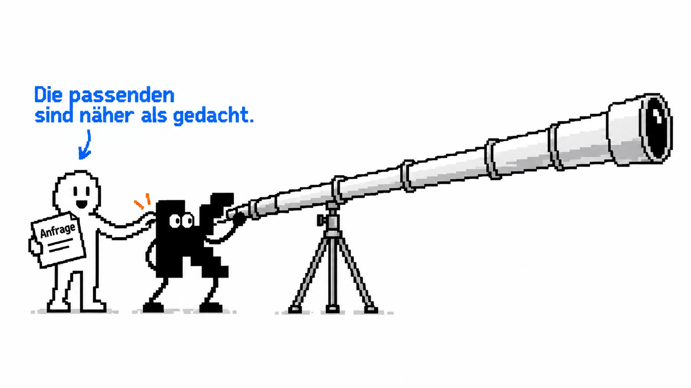](https://klarmodus.de/ratgeber/mandanten-gewinnen-steuerberater/)

[Artikel lesen](https://klarmodus.de/ratgeber/mandanten-gewinnen-steuerberater/) · [WebP herunterladen](assets/mandanten-gewinnen-steuerberater-illustrations/pixel-art/02-mandanten-aufspueren.webp) · [PNG-Original](assets/mandanten-gewinnen-steuerberater-illustrations/pixel-art/02-mandanten-aufspueren.png)

### Marketing für Steuerberater: Welche Maßnahmen sich zuerst lohnen

[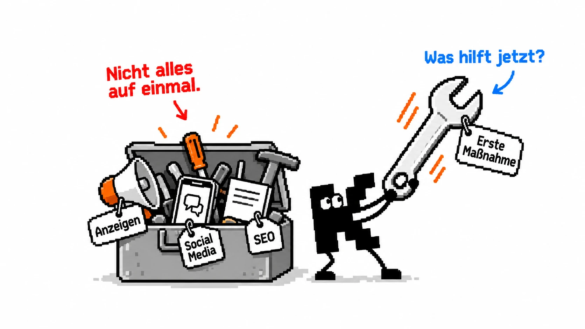](https://klarmodus.de/ratgeber/marketing-fuer-steuerberater-massnahmen-priorisieren/)

[Artikel lesen](https://klarmodus.de/ratgeber/marketing-fuer-steuerberater-massnahmen-priorisieren/) · [WebP herunterladen](assets/marketing-fuer-steuerberater-massnahmen-priorisieren-illustrations/pixel-art/01-marketing-werkzeugkasten.webp) · [PNG-Original](assets/marketing-fuer-steuerberater-massnahmen-priorisieren-illustrations/pixel-art/01-marketing-werkzeugkasten.png)

### Dürfen Anwälte Werbung machen?

[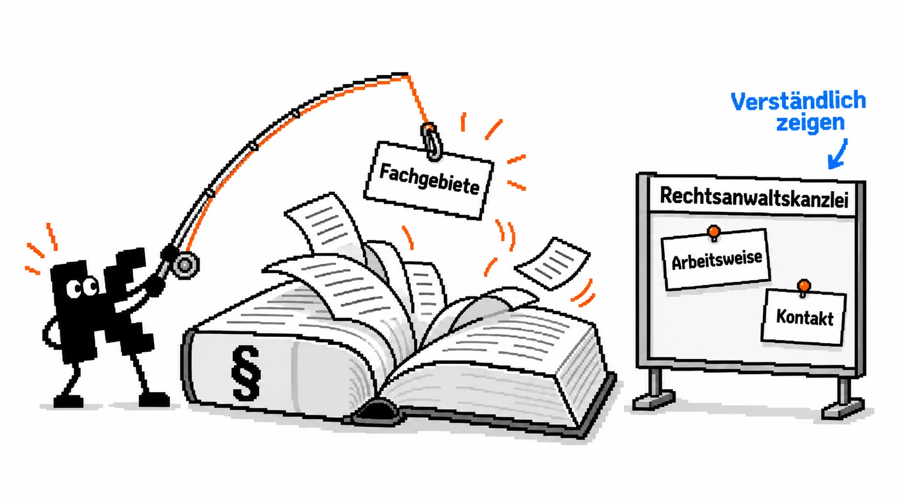](https://klarmodus.de/ratgeber/duerfen-anwaelte-werbung-machen/)

[Artikel lesen](https://klarmodus.de/ratgeber/duerfen-anwaelte-werbung-machen/) · [WebP herunterladen](assets/duerfen-anwaelte-werbung-machen-illustrations/pixel-art/01-fachwissen-greifbar-machen.webp) · [PNG-Original](assets/duerfen-anwaelte-werbung-machen-illustrations/pixel-art/01-fachwissen-greifbar-machen.png)

### Dürfen Steuerberater Werbung machen?

[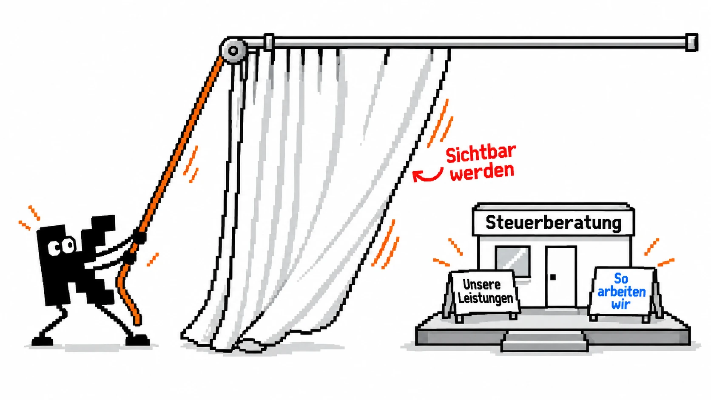](https://klarmodus.de/ratgeber/duerfen-steuerberater-werbung-machen/)

[Artikel lesen](https://klarmodus.de/ratgeber/duerfen-steuerberater-werbung-machen/) · [WebP herunterladen](assets/duerfen-steuerberater-werbung-machen-illustrations/pixel-art/03-kanzlei-sichtbar-machen.webp) · [PNG-Original](assets/duerfen-steuerberater-werbung-machen-illustrations/pixel-art/03-kanzlei-sichtbar-machen.png)

## Bildergalerie

Die Sammlung enthält 14 Beispielmotive, jeweils als Handzeichnung und Pixel-Art. Beide Stile verwenden den K-Macher und dieselben deutschen Beschriftungen. Handzeichnung setzt auf lockere Stiftlinien und Handschrift; Pixel-Art auf sichtbare Pixelstufen, Pixelschrift und wenige Grauflächen.

| Handzeichnung | Pixel-Art |
| --- | --- |
| [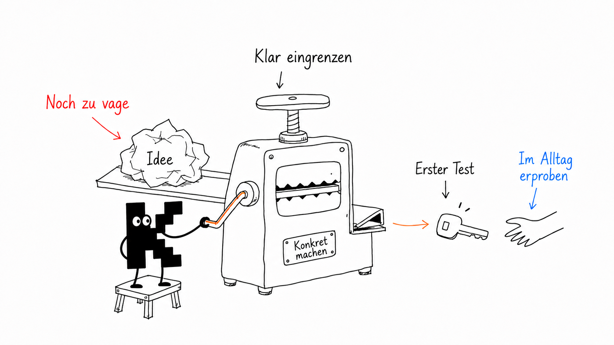](examples/images/06-idea-press.png) | [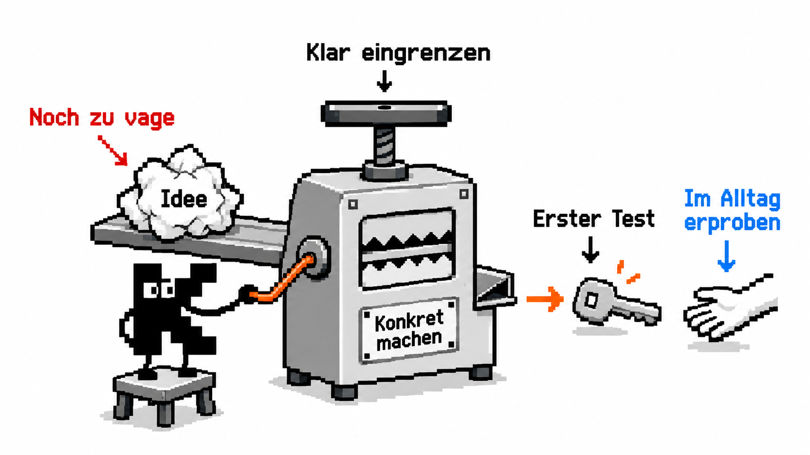](examples/images-pixel/06-idea-press.png) |

Ein Klick öffnet die PNG-Datei. Unter den folgenden Handzeichnungen findest du jeweils auch die Pixelvariante. Die [Motivbeschreibungen und Bildtexte](examples/illustration-prompts.md) sowie die [Übersicht aller 14 Stilpaare](examples/pixel-prompts.md) liegen ebenfalls im Repository.

<!-- Zugehörige veröffentlichte Blogartikel direkt unter dem jeweiligen Motiv verlinken. -->

### Wo Inhalte ins Stocken geraten

[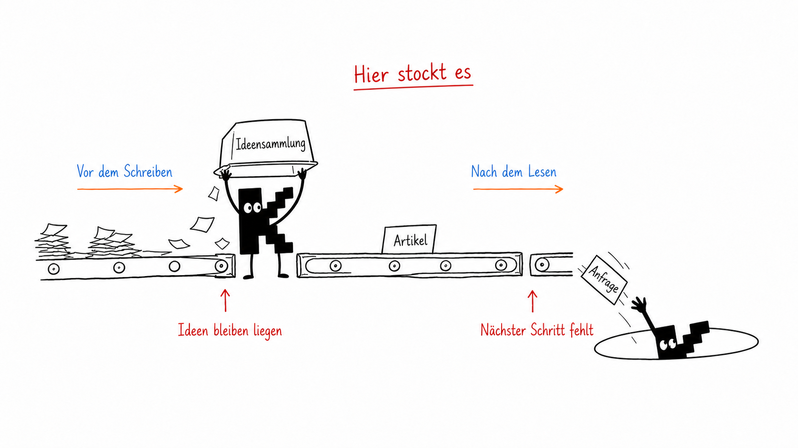](examples/images/01-two-breakpoints.png)

[Handzeichnung](examples/images/01-two-breakpoints.png) · [Pixel-Art](examples/images-pixel/01-two-breakpoints.png)

### Inhalte nach ihrem Ziel sortieren

[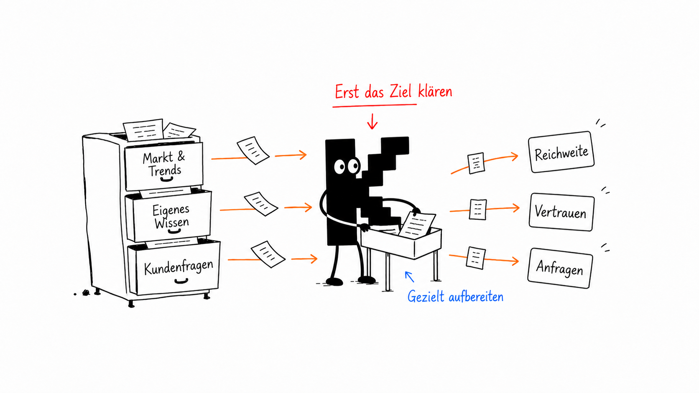](examples/images/02-sort-by-purpose.png)

[Handzeichnung](examples/images/02-sort-by-purpose.png) · [Pixel-Art](examples/images-pixel/02-sort-by-purpose.png)

### Ein Thema mehrfach nutzen

[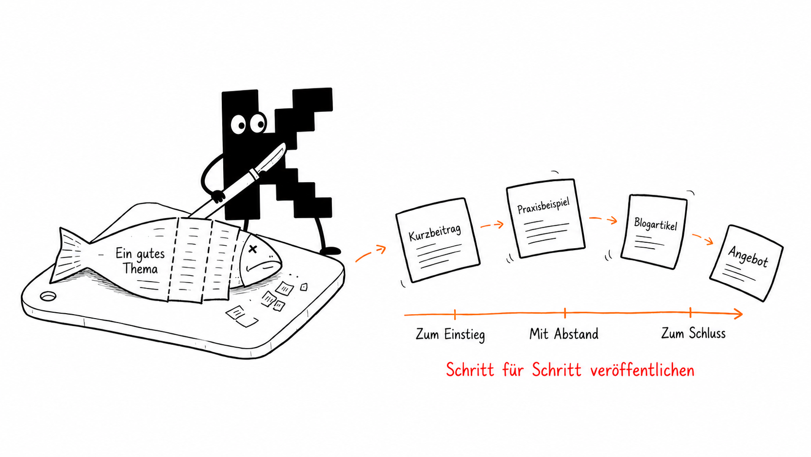](examples/images/03-one-fish-many-uses.png)

[Handzeichnung](examples/images/03-one-fish-many-uses.png) · [Pixel-Art](examples/images-pixel/03-one-fish-many-uses.png)

### Vom Artikel zur Anfrage

[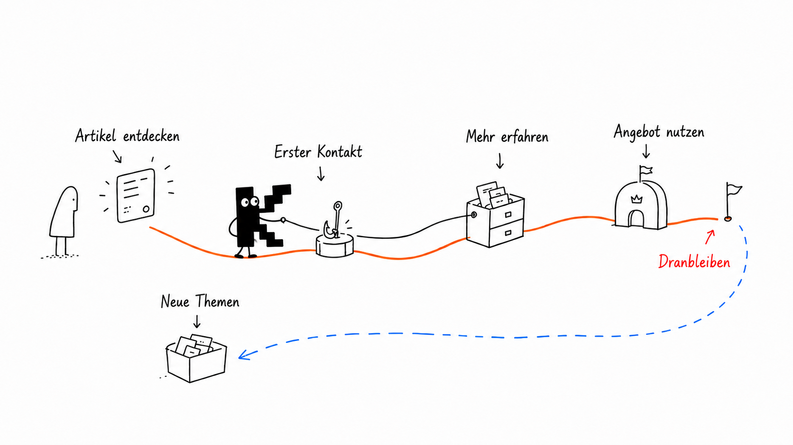](examples/images/04-handoff-path.png)

[Handzeichnung](examples/images/04-handoff-path.png) · [Pixel-Art](examples/images-pixel/04-handoff-path.png)

### Aus Wissen brauchbare Ideen machen

[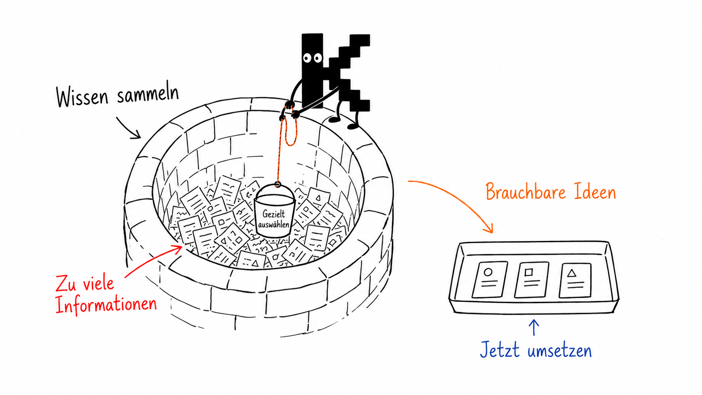](examples/images/05-information-well.png)

[Handzeichnung](examples/images/05-information-well.png) · [Pixel-Art](examples/images-pixel/05-information-well.png)

### Eine Idee konkret machen

[](examples/images/06-idea-press.png)

[Handzeichnung](examples/images/06-idea-press.png) · [Pixel-Art](examples/images-pixel/06-idea-press.png)

### Wissen weiterentwickeln

[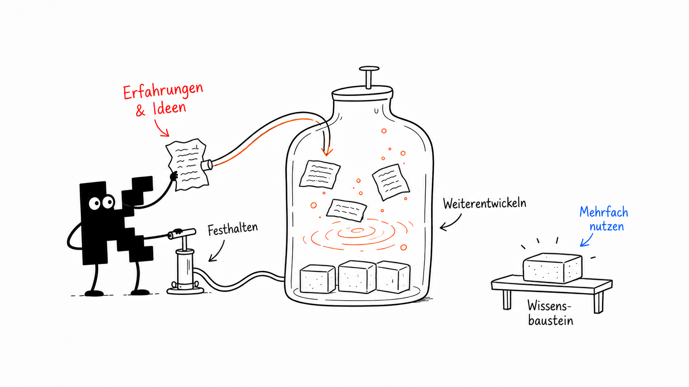](examples/images/07-content-fermentation.png)

[Handzeichnung](examples/images/07-content-fermentation.png) · [Pixel-Art](examples/images-pixel/07-content-fermentation.png)

### Vertrauen durch Belege aufbauen

[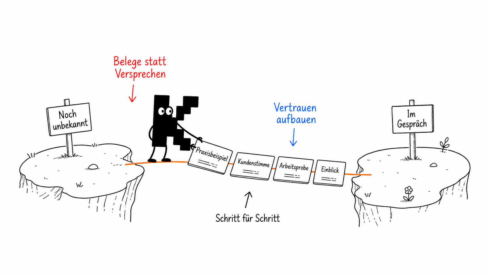](examples/images/08-trust-bridge.png)

[Handzeichnung](examples/images/08-trust-bridge.png) · [Pixel-Art](examples/images-pixel/08-trust-bridge.png)

Weitere Motive als PNG, jeweils mit beiden Varianten in der [vollständigen Übersicht](examples/pixel-prompts.md):

- [Von der Themenidee zur Rückmeldung](klarmodus-de-blog-illustrationen/assets/examples/02-minimum-loop.png)
- [Themen aus verschiedenen Quellen sammeln](klarmodus-de-blog-illustrationen/assets/examples/06-three-sources.png)
- [Aufmerksamkeit, Vertrauen oder Kontakt](klarmodus-de-blog-illustrationen/assets/examples/07-three-content-jobs.png)
- [Ein passender nächster Schritt nach dem Artikel](klarmodus-de-blog-illustrationen/assets/examples/08-handoff-copy-toolbox.png)
- [Typische Fehler bei der Inhaltserstellung](klarmodus-de-blog-illustrationen/assets/examples/09-common-pits-no-title.png)
- [Routine abgeben und den Überblick behalten](klarmodus-de-blog-illustrationen/assets/examples/13-system-bearing.png)

## Den Skill in Codex nutzen

Die Anweisungen für die Bilderzeugung stehen in [SKILL.md](klarmodus-de-blog-illustrationen/SKILL.md). Der Skill-Ordner enthält auch die Stilregeln, Figurenreferenzen und eine Checkliste zur Bildprüfung.

Ohne Stilvorgabe erstellt der Skill Pixel-Art. Handzeichnung erhältst du auf ausdrücklichen Wunsch. Du kannst auch beide Varianten desselben Motivs anfordern.

Kopiere nach dem Klonen diesen Unterordner in dein Codex-Skills-Verzeichnis:

```bash
git clone https://github.com/klarmodus/klarmodus-de-blog-illustrationen.git
cd klarmodus-de-blog-illustrationen
mkdir -p "${CODEX_HOME:-$HOME/.codex}/skills"
cp -R ./klarmodus-de-blog-illustrationen "${CODEX_HOME:-$HOME/.codex}/skills/"
```

Beispiel für den Aufruf in Codex mit Bildgenerierung:

```text
Nutze $klarmodus-de-blog-illustrationen, um drei passende Illustrationen
im Modus Pixel-Art für den folgenden Blogartikel zu erstellen. Verwende den K-Macher
und kurze, natürlich deutsche Beschriftungen.

<Artikel einfügen>
```

Weitere Varianten, etwa zur reinen Bildplanung oder zur Bearbeitung eines vorhandenen Bildes, findest du in den [Beispielprompts](examples/prompts.md).

## Woher das Projekt kommt

Die Grundlage ist [Ian Xiaohei Illustrations](https://github.com/helloianneo/ian-xiaohei-illustrations) von Ian. Wir haben seine Vorlage für unseren Anwendungsfall bei Klarmodus angepasst: mit deutschen Bildtexten, unserem K-Maskottchen und Beispielen für Blogartikel.

Die unveränderten Originalbilder sind in den gekennzeichneten `*-original`-Ordnern archiviert. Einzelheiten zur Herkunft stehen in [NOTICE.md](NOTICE.md).
